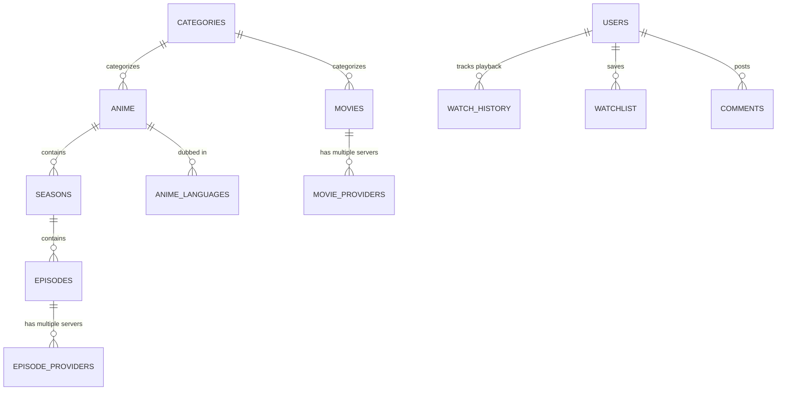

# AnimeBro - Complete Database Architecture & Schema Guide

> **Technical Reference for Data Structures, Table Relationships, and Indexing**

---

## 1. Overview of Database Architecture

AnimeBro uses a relational MySQL/MariaDB database designed for fast indexed lookups, zero N+1 query overhead, and strict referential integrity. All tables utilize the `InnoDB` storage engine with `utf8mb4` character encoding (`utf8mb4_unicode_ci`), providing full multi-language and emoji support.

---

## 2. Master Table Inventory

| Table Name | Purpose | Primary Key | Foreign Keys / Dependencies |
| :--- | :--- | :--- | :--- |
| `admin` | Super Admin & staff authentication | `id` | None |
| `users` | Registered end users | `id` | `avatar_id` &rarr; `avatar_library(id)` |
| `avatar_library` | Curated profile avatars | `id` | None |
| `categories` | Genre taxonomies (Action, Comedy, etc.) | `id` | None |
| `anime` | Anime & Cartoon series catalog | `id` | `category_id` &rarr; `categories(id)` |
| `anime_languages` | Multi-language dub tagging per series | `id` | `anime_id` &rarr; `anime(id)` |
| `seasons` | Series seasons | `id` | `anime_id` &rarr; `anime(id)` |
| `episodes` | Series episodes & legacy player embeds | `id` | `anime_id`, `season_id` |
| `episode_providers`| Multi-provider streaming servers per episode | `id` | `episode_id` &rarr; `episodes(id)` |
| `movies` | Feature film catalog | `id` | `category_id` &rarr; `categories(id)` |
| `movie_providers` | Multi-provider streaming servers per movie | `id` | `movie_id` &rarr; `movies(id)` |
| `movie_watchlist` | User film watchlists | `id` | `user_id`, `movie_id` |
| `watchlist` | User series watchlists | `id` | `user_id`, `anime_id` |
| `watch_history` | Playback progress & continue watching | `id` | `user_id`, `anime_id`, `episode_id` |
| `comments` | Threaded user comments | `id` | `user_id`, `episode_id`, `movie_id` |
| `reports` | Broken link & playback issue reports | `id` | `episode_id`, `anime_id`, `movie_id` |
| `hero_banners` | Featured homepage slider cards | `id` | `anime_id` / `movie_id` (optional) |
| `pages` | Static content pages (DMCA, Terms, Privacy)| `id` | None |
| `settings` | Key-value application configuration | `setting_key` | None |
| `staff_roles` | Granular permission roles for staff | `id` | None |
| `staff_permissions`| Mapping of permissions per staff user | `id` | `user_id` &rarr; `admin(id)` |
| `server2_promos` | Promotional banners for Server 2 | `id` | None |
| `announcements` | Global site alert banners | `id` | None |
| `admin_messages` | Private user-to-admin tickets/chat | `id` | `user_id` &rarr; `users(id)` |
| `landing_features` | Feature value cards for Landing Page | `id` | None |
| `landing_steps` | 3-step walkthrough cards for Landing Page | `id` | None |
| `landing_faqs` | Accordion FAQ entries for Landing Page | `id` | None |
| `landing_socials` | Community channel cards for Landing Page | `id` | None |
| `landing_showcase`| Pinned manual showcase items for Landing | `id` | `item_id` &rarr; `anime`/`movies` |

---

## 3. Key Relationships & ER Architecture

---

## 4. Automatic Schema Bootstrapping

AnimeBro includes automatic, idempotent database schema migrations via `bootstrap_landing_page_schema($pdo)` and runtime self-healing checks inside `common/config.php`. When new columns or tables are introduced, the application validates table presence automatically without interrupting production operations.
